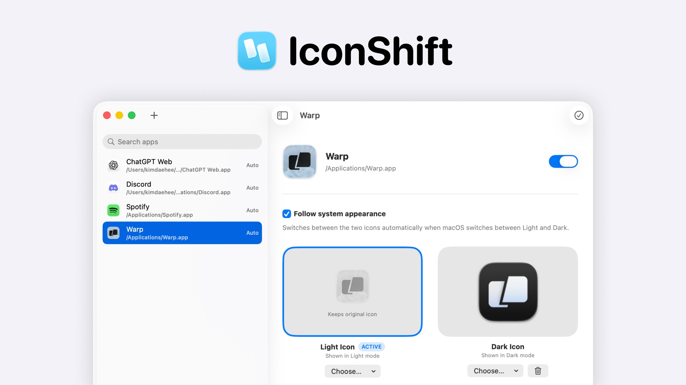

  <picture>
    <source media="(prefers-color-scheme: dark)" srcset="docs/images/banner-dark.jpg">
    
  </picture>

<a href="README.md">English</a> · <a href="README_ko.md">한국어</a> · 日本語

  <a href="https://github.com/kimdaehee0824/IconShift/releases/latest/download/IconShift.dmg"><picture><source media="(prefers-color-scheme: dark)" srcset="docs/images/download-dark.svg"></picture> <b>macOS版をダウンロード</b></a> · macOS 14+ · Universal

ダークモードをオンにすると、Macのすべてが暗くなります。あのアイコンひとつを除いて。**IconShift**は、まさにそのアイコンのための小さなメニューバーアプリです。アプリごとにライト用・ダーク用のアイコンを1つずつ指定しておくと、システムの外観が変わるたびにFinderとDockのアイコンも切り替わります。

犯人はたいていSafariやChromeのWebアプリです。片方の背景だけを想定して描かれたアイコンなので、反対のモードでは浮いて見えます。

- **自動切り替え**: システムの外観が変わった瞬間に、ライトまたはダークのアイコンを適用
- **アプリごとの設定**: システムに従うほか、常にライト・常にダークに固定
- **簡単な設定**: PNGやICNSファイルをアイコン欄にドロップするか、ファイルから選択
- **ログイン時に起動**: ログイン後に静かに起動し、アイコンを同期した状態に維持
- **メニューバーアイコンの非表示**: アイコンを隠してもバックグラウンドで動作を継続
- **自動復元**: ブラウザのアップデートで時々アイコンが元に戻されても、起動のたびに再適用

## 動作環境

| 項目  | 要件                              |
| ----- | --------------------------------- |
| macOS | 14以降                            |
| Mac   | AppleシリコンとIntel（Universal） |

IconShiftを使うためにXcodeや開発者ツールを用意する必要はありません。

## インストール

1. [GitHub Releases](https://github.com/kimdaehee0824/IconShift/releases)から最新の`IconShift-<バージョン>.dmg`をダウンロードします。
2. DMGを開き、`IconShift.app`を「アプリケーション」フォルダにドラッグします。
3. IconShiftを一度開きます。まだ公証（ノータリゼーション）されていないリリースのため、macOSが初回起動をブロックすることがあります。その場合は**システム設定 > プライバシーとセキュリティ**を開き、**セキュリティ**で**このまま開く**をクリックしてから、**開く**で確認します。
4. IconShiftが初めてアプリアイコンを変更するとき、macOSが**アプリ管理**へのアクセス許可を求めます。**許可**をクリックしてください。通知を閉じてしまった場合は、**システム設定 > プライバシーとセキュリティ > アプリ管理**でIconShiftを有効にします。

公証されたリリースを提供するまでは、IconShiftのアップデート後にこれらの許可をやり直す必要がある場合があります。

## 使い方

1. IconShiftを開き、サイドバーの**アプリを追加**をクリックします。
2. インストール済みのアプリを選び、**ライトアイコン**と**ダークアイコン**の欄に画像をドロップします。
3. 自動切り替えを使うには**システムの外観に従う**をオンにしておきます。オフにすると、**常にライト**または**常にダーク**に固定できます。
4. 選択したアイコンをすぐに適用したいときは、**今すぐ適用**をクリックします。

**設定 > 一般**では、**ログイン時に起動**と**メニューバーアイコンを表示**を変更できます。メニューバーアイコンを隠したあとでウインドウを開くには、IconShiftをもう一度起動してください。**設定 > 情報**では、バージョンとライセンスを確認できます。

Finderのアイコンはすぐに切り替わります。すでに起動しているアプリは、終了して開き直すまでDockに以前のアイコンが残りますが、これはmacOSのDockの通常の動作です。IconShiftは起動するたびに設定済みのアイコンを再適用するため、SafariやChromeのアップデートでリセットされたWebアプリのアイコンも自然に復元されます。

アイコンファイルが必要な場合は、[macOSicons](https://macosicons.com)からPNGまたはICNSアイコンをダウンロードし、IconShiftへドラッグするか**選択…**で指定できます。IconShiftはmacOSiconsと提携しておらず、APIも使用しません。アイコンの提供状況とライセンスには、macOSiconsおよび各作成者の方針が適用されます。

## コントリビューション

開発環境の構築とコントリビューションの手順は[CONTRIBUTING.md](CONTRIBUTING.md)にまとめています。

## ライセンス

IconShiftは[MIT License](LICENSE)のもとで公開されています。
